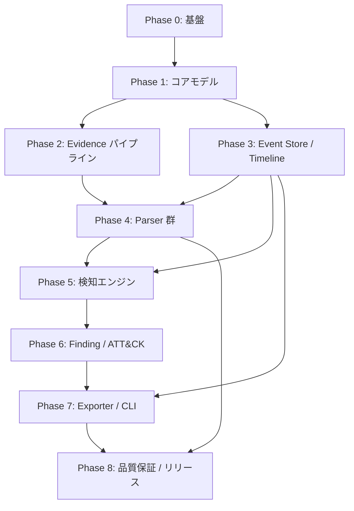

# TraceForge 実装ロードマップ v1.0

> Windows Forensic Timeline & Evidence Correlation Engine written in Rust

## 1. 文書情報

| 項目 | 内容 |
|---|---|
| 文書種別 | 実装ロードマップ |
| 製品 | TraceForge |
| バージョン | 1.0 |
| 対象 | v1.0 Stable までの開発順序、フェーズ、マイルストーン、リスク |
| 規範性 | 非規範。開発管理上の計画文書。動作・形式の正本は各仕様書 |

製品仕様書 §15 により、実装範囲・進捗・開発順序は製品仕様に含めないため、本書へ分離して管理する。

参照文書（記述が矛盾する場合の優先順位もこの順）:

1. TraceForge Schema仕様書 v1.0（`traceforge_schemas_v1.0.md`）
2. TraceForge 規範コア仕様書 v1.0（`traceforge_normative_core_specification_v1.0.md`）
3. TraceForge 互換性仕様書 v1.0（`traceforge_compatibility_v1.0.md`）
4. TraceForge 製品仕様書 v1.0（`traceforge_product_specification_v1.0.md`）

詳細タスクは `traceforge_implementation_tasks_v1.0.md` を参照する。

## 2. 目的

4文書の仕様を満たす v1.0 Stable を、検証可能な中間成果物を積み上げながら完成させること。各フェーズは「次のフェーズの前提となる検証済み成果物」を出力する。

本書は期日を定めない。順序と依存関係、完了条件のみを定義する。

## 3. 基本方針

### 3.1 Schema-first

全機能が依存する型・ID・時刻モデル・canonical JSON を最初に固定する。仕様書の Rust 構造体例と JSON Schema をそのまま実装の出発点とし、後からの型変更を最小化する。

### 3.2 早期の縦割りスライス

Parser 全種完成を待たず、LNK 1種で `analyze` → Event Store → Timeline → JSON Case 出力 → Manifest までを早期に通す（M2）。これにより決定性・再現性・Provenance の設計欠陥を初期に検出する。

### 3.3 決定性の設計先行

並列化（F-024）は後付けすると破綻しやすい。source ordinal、Event ID、sort 規則、`BTreeMap` の使用など規範 §13.2 の規則をコア層で先に徹底し、golden test を初期から回す。

### 3.4 Supported 宣言の品質ゲート

互換性仕様書 §12 の acceptance test 8項目を満たさない Parser・形式を Supported と表明しない。fixture、negative test、Provenance 到達、thread 間一致を各 Parser の完了条件とする。

### 3.5 依存の pin

YARA-X crate、ATT&CK dataset、参照仕様 revision は `latest` を使わず version を pin し、hash を Manifest・リリース記録へ残す（互換 §7、§9、§11）。

## 4. フェーズ概要

| Phase | 名称 | 主な成果物 | マイルストーン |
|---|---|---|---|
| 0 | プロジェクト基盤 | workspace、CI、fuzz/bench 環境、fixture 方針 | — |
| 1 | コアデータモデルと Schema | core crate、決定的 ID、時刻モデル、Schema validator | M1 |
| 2 | Evidence パイプライン | discovery、snapshot、SHA-256、識別、limit | — |
| 3 | Event Store と Timeline | spool store、決定的 iteration、external sort | — |
| 4 | Parser 群 | 7 Parser + fixture + acceptance test | M2（途中）、M3 |
| 5 | 検知エンジン | Sigma subset、YARA-X、Correlation | — |
| 6 | Finding 統合と ATT&CK | Finding merger、Confidence、ATT&CK mapping | M4 |
| 7 | Exporter と CLI | 6出力形式、9 command、Manifest 確定 | M5 |
| 8 | 品質保証とリリース | golden/fuzz/bench、release gate | M6 |

## 5. フェーズ詳細

### Phase 0: プロジェクト基盤

目的: 以降の全開発が載る環境を整備する。

主な成果物:

- Cargo workspace と crate 分割（案: `core` / `evidence` / `store` / `parsers` / `engines` / `findings` / `export` / `cli`）
- ツールチェイン固定（`rust-toolchain.toml`）と CI（fmt、clippy、test、doc）
- cargo-deny による license・security advisory チェック（互換 §11）
- cargo-fuzz 雛形（F-025）、criterion benchmark 雛形（F-026）
- fixture 管理方針（`tests/fixtures`、SHA-256・生成 OS・取得方法の記録形式）

完了条件: 空実装で CI が通り、fuzz/bench 雛形が動作する。

### Phase 1: コアデータモデルと Schema

目的: 全機能の前提となる型と Schema を固定する。

主な成果物:

- length-prefixed encoding と決定的 ID 6種（規範 §12）
- `EventTime` / `TemporalValue` と変換規則・DST 処理（規範 §6、Schema §4）
- `Event` / `Provenance` / `RecordLocator` / `ProcessRef`（規範 §7）
- `WindowsPathValue` と `windows-path-v1` profile（規範 §8）
- Case / Evidence / Artifact / Issue / Match / Finding / Manifest 型（Schema §5）
- canonical JSON serializer と Schema validator（Schema §2.1、§9）
- TOML 設定、優先順位、validation、resolved config digest（Schema §8）
- Error 型、Exit Code、scope 付き strict mode（規範 §17）

完了条件: Schema §9 の全 fixture test が通る。ID・時刻・path の unit/property test が通る。

### Phase 2: Evidence パイプライン

目的: `analyze` 前半（discovery → snapshot → hash → 識別）を完成させる。

主な成果物:

- `source_locator` 正規化、決定的 discovery、symlink skip（規範 §5.2–5.3）
- read-only snapshot + 同時 SHA-256 + before/after integrity check（規範 §5.5）
- Evidence ID / Case ID 生成（規範 §4.1、§5.6）
- 入出力分離検証と overwrite 保護（規範 §5.4）
- Artifact 識別 framework（`probe` と ambiguous 処理、規範 §11）
- resource limit framework（規範 §18、Schema §8.2）

完了条件: 規範 §21 の 3（snapshot 中書換）、9（input 内 output 拒否）、10（symlink loop）の test が通る。

### Phase 3: Event Store と Timeline

目的: 決定的な Event 永続化・反復の基盤を作る。

主な成果物:

- length-delimited spool file Event Store（規範 §10）
- 書き込み時 Schema validation、Event ID 一意制約、commit marker、権限制限
- timestamp group + Event ID による決定的 iteration
- memory budget 超過時の external merge sort（規範 §10）
- Timeline 5 group の順序付け（規範 §6.3）
- 縦割り用の最小 JSON 出力

完了条件: 規範 §21 の 6（100万 Event で全件 Vec 不要）、8（同一 timestamp の安定順）の test が通る。

### Phase 4: Parser 群

目的: 7種の Parser を互換性仕様の acceptance 品質で実装する。

順序と内容:

1. Parser framework（`ArtifactParser` trait、`ParseSink`、`ParseSummary`、panic 境界、規範 §9）
2. **LNK**（`[MS-SHLLINK]`）— 自己完結形式。完了時点で M2 の縦割りを達成
3. **Prefetch**（v17/23/26/30/31、MAM 展開）
4. **USN Journal**（V2/V3/V4、rename 結合、path reconstruction 制約）
5. **EVTX**（file/chunk/record、binxml、typed mapping 5種、partial recovery）
6. **Registry**（hive 構造、LOG1/LOG2 replay、dual view、観測型 Event）
7. **Amcache**（Win10 22H2 / Win11 24H2 schema family）
8. **Jump Lists**（CFB container、DestList、内包 LNK）

各 Parser の完了条件（互換 §12 より）:

- 正常 fixture から期待 Event を生成する
- truncated・invalid length・unknown version で panic しない
- Provenance が元 record へ到達する
- 1 thread と複数 thread の出力が一致する
- fixture の SHA-256・生成 OS・取得方法・期待結果を記録する
- 使用した外部仕様 revision / dependency version を記録する
- 非対応 field・構文・version を黙って無視しない
- 形式の意味を越えて Event type を断定しない（観測型の遵守）

### Phase 5: 検知エンジン

目的: Sigma・YARA-X・Correlation の3経路の検知を実装する。

主な成果物:

- Sigma: TF-SIGMA-1.0 subset evaluator、field mapping、未対応構文の Rule 全体 skip（互換 §6、規範 §15.1）
- YARA-X: crate pin、verified snapshot scan、3 mode、compile error 処理（互換 §7、規範 §15.2）
- Correlation: YAML Rule parse（anchor/alias/duplicate key 禁止）、Schema 検証、sequence 評価、`within` / `partition_by` / `bind`、score 計算（Schema §7、規範 §14）
- Rule file の 1回読み込み・raw bytes SHA-256（規範 §14）

完了条件: 規範 §21 の 12（Sigma skip）、13（suspicious mode の path 解決）、14（limit 到達時 `complete=false`）の test が通る。

### Phase 6: Finding 統合と ATT&CK

目的: 3検知結果を説明可能な Finding へ統合する。

主な成果物:

- Finding merger（match の喪失なし、自動統合禁止、規範 §16）
- Confidence score → level 変換（規範 §14.3）
- 決定的 Finding ID（規範 §12.4）
- ATT&CK dataset pin、ID 検証、mapping 生成（互換 §9、規範 §15.3）

完了条件: Finding から全元 Event・Evidence・Rule hash へ到達できる test が通る。

### Phase 7: Exporter と CLI 完成

目的: 全出力形式と全 command を完成させ、製品として使える状態にする。

主な成果物:

- Text / JSON / JSONL / CSV / HTML / Timesketch の6 Exporter（規範 §19、互換 §8・§10）
- 出力安全性（制御文字 escape、CSV formula 対策、HTML CSP）
- `analyze` / `timeline` / `correlate` / `sigma` / `yara` / `export` / `rules` / `inspect` / `version` の9 command（製品 §12）
- Analysis Manifest 確定と Exit Code 集約（規範 §20、§17.2）

完了条件: 規範 §21 の 11（出力 injection 対策）、15（Schema validation）の test が通る。Timesketch 除外件数記録が動作する。

### Phase 8: 品質保証とリリース

目的: 製品仕様 §13 の品質要件をすべて自動化し、release gate を通す。

主な成果物:

- Golden determinism test（`--threads 1/2/自動` で canonical JSON が byte 一致、規範 §13.3）
- integration / regression / property test の整備
- fuzz corpus 整備と campaign、input 起因 panic ゼロ確認
- integrity test（解析中の入力変更再現）
- benchmark 実測（測定条件付き、製品 §13.2）
- 全 Required 対象の compatibility acceptance 最終確認
- README 例の実 fixture からの自動生成
- dependency / license / advisory 記録（互換 §11）

完了条件: §8 の release gate 全項目を満たす。

## 6. マイルストーン

| ID | 名称 | 到達内容 | 対象 Phase |
|---|---|---|---|
| M1 | コア基盤完成 | Schema fixture test 合格、ID/時刻/path モデル確定 | 0–1 |
| M2 | 縦割りスライス完成 | LNK のみで `analyze` → Case JSON + Manifest が生成される | 2–4（一部） |
| M3 | 全 Parser 完成 | 7 Parser が acceptance test 合格 | 4 |
| M4 | 検知・統合完成 | Sigma/YARA-X/Correlation → Finding → ATT&CK が通る | 5–6 |
| M5 | 機能完成 | 6出力・9 command が揃う（feature complete） | 7 |
| M6 | v1.0 Stable | release gate 全合格 | 8 |

## 7. 依存関係とクリティカルパス

クリティカルパスは Phase 1 → 2/3 → 4 → 5 → 6 → 7 → 8。次は並行推進可能である。

- fixture 収集（実 Windows 環境の調達を含む）は Phase 0 から全期間で並行実施
- fuzz harness と benchmark は対象実装の完成直後から随時追加
- Exporter のうち JSON/JSONL は golden test の都合上 Phase 3 で最小版を先行実装

## 8. 完了条件（release gate）

製品仕様書 §13.2 より、v1.0 Stable は次をすべて満たす。

- [ ] 対応対象が互換性仕様書で `Required` または `Supported` として明示されている
- [ ] Schema validation が成功する
- [ ] 同一 fixture を 1 thread と複数 thread で解析し、分析レコードが byte 単位で一致する
- [ ] 破損 fixture と fuzz corpus で input 起因 panic がない
- [ ] Parser issue、limit 到達、skip が Analysis Manifest へ残る
- [ ] README 等の例が実際の fixture から生成されている
- [ ] benchmark 値は測定条件とともに実測値だけを掲載する

加えて、規範 §21 の受け入れ条件 15項目の自動化 test がすべて通ること（タスクリスト §10 のトレーサビリティ表で管理）。

## 9. リスクと対策

| リスク | 影響 | 対策 |
|---|---|---|
| EVTX binxml の複雑性 | Phase 4 遅延 | Phase 0–1 で既存 crate の調査を実施。自前実装との比較を早期決定。partial recovery を設計要件に含める |
| Registry transaction log replay の複雑性 | Phase 4 遅延 | dual view（base / recovered）要件を満たす最小実装を先行プロトタイプ。replay 不可時の `partial` 扱いを framework で保証 |
| MAM 圧縮の展開実装 | Prefetch 遅延 | pure Rust 実装の要否と既存ライブラリを Phase 4 着手前に調査。展開後 bytes の Provenance 扱いを core で先に決める |
| CFB container（Jump Lists） | Phase 4 遅延 | crate 利用を第一候補とし、version pin。内包 LNK は LNK Parser を再利用する設計 |
| fixture 調達（Win 7 SP1 / 10 22H2 / 11 24H2 の実環境生成物） | acceptance test 未達 | Phase 0 から並行で収集計画を開始。生成手順・SHA-256 を記録する運用を fixture 方針に含める |
| 決定性の破壊（並列化・hash map 依存） | M6 阻害 | 規範 §13.2 の規則を core 層で強制。golden test を M2 以降の全マイルストーンで実行 |
| YARA-X / ATT&CK 等の外部依存の変動 | 再現性喪失 | version pin + hash 記録 + cargo-deny を CI で強制（互換 §11） |
| Sigma 実装の過剰適合 | 誤検知・仕様違反 | 変換せず subset 評価を自前実装。未対応要素の検出を validation 層で確実に行う（互換 §6.2） |

## 10. 変更管理

- 本書と仕様書が矛盾した場合、仕様書を優先し、本書を修正する。
- フェーズ構成・マイルストーンの変更は本書の version を更新して記録する。
- タスク単位の進捗は `traceforge_implementation_tasks_v1.0.md` の checkbox で管理し、本書には反映しない。
- 仕様書自体の変更（Schema version の更新等）が発生した場合、影響フェーズを本書へ追記する。
