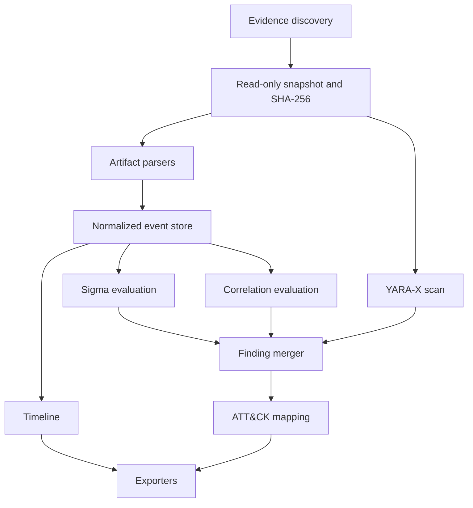

# TraceForge 製品仕様書 v1.0

> Windows Forensic Timeline & Evidence Correlation Engine written in Rust

## 1. 文書情報

| 項目 | 内容 |
|---|---|
| 文書種別 | 製品仕様書 |
| 製品 | TraceForge |
| バージョン | 1.0 |
| 対象 | 製品の目的、利用者価値、機能範囲、非目標 |
| 規範性 | 非規範。実装上の正確な動作は「TraceForge 規範コア仕様書 v1.0」に従う |
| 旧文書 | `traceforge_specification_v1.0.md` を再編した後継文書 |

本書は「何を作るか」を定義する。「どのように、どの条件で動かすか」は規範コア仕様書、「どのデータ形式で保存するか」はSchema仕様書、「何に対応するか」は互換性仕様書で定義する。

文書間で記述が異なる場合の優先順位は次のとおりとする。

1. TraceForge Schema仕様書 v1.0
2. TraceForge 規範コア仕様書 v1.0
3. TraceForge 互換性仕様書 v1.0
4. 本書

## 2. 製品概要

TraceForgeは、Windowsに残る複数のフォレンジック痕跡を読み取り、共通Eventへ変換し、時系列で整理し、関連する証拠を結び付け、調査上重要な結果をFindingとして提示するRust製CLIツールである。

TraceForgeの中心価値は、単なるファイル解析ではなく、次の処理を一貫して行うことにある。

- 複数形式のWindowsアーティファクトを共通Eventへ変換する
- Eventから元Evidenceのレコードまたは位置へ遡れるようにする
- 時刻の不確実性を隠さずTimelineを構築する
- 複数Event、Sigma、YARA-Xの結果を説明可能なFindingへまとめる
- 同じEvidence、設定、ルール、バージョンから同じ分析結果を再生成できるようにする

## 3. 想定利用者

主な利用者は次のとおりである。

- Windows端末のインシデントを調査する担当者
- DFIRを学習している学生・初学者
- 複数アーティファクトを横断して確認したいセキュリティ技術者
- JSON/JSONLやTimesketchへ調査結果を連携したい自動化担当者

利用者にフォレンジック形式の内部構造やRustの知識を要求しない。既定設定で安全かつ説明可能な解析が行え、専門的な調整は明示的なCLIまたは設定ファイルで行えるものとする。

## 4. 製品目標

### 4.1 説明可能性

各EventとFindingについて、次を確認できること。

- どのEvidenceから得られたか
- どのParserとParser versionが生成したか
- 元レコード、byte offset、またはそれに代わる位置情報は何か
- どのルールとルール内容のhashが判断に使用されたか
- 事実として観測した情報か、TraceForgeが推論した情報か

### 4.2 Read-only

TraceForgeはEvidenceへ書き込まない。解析結果はEvidenceとは別の出力先へ保存する。

TraceForge単体ではOSやストレージ装置によるアクセス時刻更新まで完全には防げないため、原本ではなくread-only mountまたは取得済み作業コピーを解析する運用を標準とする。

### 4.3 再現性

同一のEvidence内容、入力内相対パス、確定済み設定、ルール内容、外部データ、TraceForge buildから、スレッド数に依存しない同一の分析レコードと同一順序を生成する。

実行開始時刻などの運用メタデータは分析結果と分離して保存する。

### 4.4 壊れた入力への耐性

1つの破損ファイルまたは破損レコードにより、無関係なEvidenceの解析を停止しない。部分解析、skip、打ち切り、Fatalのいずれが発生したかを結果へ明示する。

### 4.5 安全性

Evidence、外部ルール、ファイル名、Eventの文字列はすべて信頼できない入力として扱う。Evidenceを実行せず、入力起因のpanic、過大allocation、無限loop、path traversal、出力注入を防ぐ。

### 4.6 拡張性

新しいParser、Event type、Rule engine、Exporterを既存機能から分離して追加できる構造とする。未対応形式を既知形式として誤解釈しない。

## 5. 対象Evidence

完成形では次を対象とする。

| 種別 | 主な用途 |
|---|---|
| Prefetch | プログラム実行痕跡 |
| EVTX | ログオン、プロセス、サービス、PowerShell、Sysmon等のEvent Log |
| USN Journal | ファイル作成、削除、変更、rename等のNTFS変更痕跡 |
| LNK | Shortcutが保持する対象、引数、volume、tracker、時刻情報 |
| Jump Lists | 最近利用されたファイルやアプリケーションの痕跡 |
| Amcache | ファイル・アプリケーションに関する記録 |
| Registry | 永続化、利用履歴、device、service等のRegistry情報 |
| 通常ファイル | YARA-X scanとEvidence inventory |

具体的なWindows version、artifact format、必須field、非対応条件は互換性仕様書で固定する。

## 6. 正式パイプライン

製品全体では次の1つのパイプラインを正本とする。



重要な責務分離は次のとおりである。

- ParserはEvidenceから観測可能な事実を抽出する。
- TimelineはEventを決定的に並べ、時刻不明Eventを捏造しない。
- Sigmaは対応可能なNormalized EventにDetection Ruleを評価する。
- Correlationは複数Event間の関係をルールで評価する。
- YARA-XはEvidenceのbytesをデータとしてscanする。
- Finding Mergerは各検知結果をEventとEvidenceへ結び付ける。
- ATT&CK mappingはルールまたは明示されたmappingだけを使用する。

## 7. 機能範囲

| ID | 機能 |
|---|---|
| F-001 | Prefetch解析 |
| F-002 | EVTX解析 |
| F-003 | USN Journal解析 |
| F-004 | LNK解析 |
| F-005 | Jump Lists解析 |
| F-006 | Amcache解析 |
| F-007 | Registry解析 |
| F-008 | 共通Eventモデル |
| F-009 | Timeline生成・filter・summary |
| F-010 | Evidence provenance |
| F-011 | SHA-256 Evidence hash |
| F-012 | Correlation Engine |
| F-013 | Finding生成と統合 |
| F-014 | Confidence Score |
| F-015 | Sigma Rule評価 |
| F-016 | YARA-X scan |
| F-017 | MITRE ATT&CK mapping |
| F-018 | Text出力 |
| F-019 | JSON出力 |
| F-020 | JSONL出力 |
| F-021 | CSV出力 |
| F-022 | 静的HTML report |
| F-023 | Timesketch-compatible JSONL |
| F-024 | 並列解析 |
| F-025 | Fuzzing |
| F-026 | Benchmark |
| F-027 | 破損ファイル・部分解析 |
| F-028 | TOML設定ファイル |
| F-029 | YAML Correlation Rule |
| F-030 | CLI filter |
| F-031 | 時刻・timezone・精度・不確実性管理 |
| F-032 | Case単位解析 |
| F-033 | 解析summaryとAnalysis Manifest |
| F-034 | Entity正規化 |
| F-035 | 重複Event識別とCorrelation |

## 8. Caseと分析結果

1回の`analyze`をCaseとして扱う。Caseは次の論理要素を持つ。

- Case metadata
- Evidence inventory
- Artifact instance inventory
- Normalized Events
- Parser issues
- Sigma/YARA-X/Correlation matches
- Findings
- Analysis Manifest
- Export metadata

実装時に全Eventをmemory上の`Vec`へ保持する必要はない。大量データでは一時Event storeとstreaming exportを使用する。

## 9. EventとTimeline

Eventは、Evidenceから得た1つの観測またはTraceForgeが生成した1つの推論を表す。

最低限、次を保持する。

- 決定的Event ID
- Event time。UTC instant、timezone不明のlocal time、range、unknownを区別する
- Event typeとtimestamp kind
- ObservedまたはInferredの区別
- hostname、user、path、program、process等の型付き情報
- artifact固有の追加attributes
- Provenance

Timelineは比較可能な時刻だけを順序付けする。timezone不明のlocal timeやunknown timeを、根拠なくUTC Timelineへ混在させない。

## 10. CorrelationとFinding

Correlation RuleはYAMLで記述し、次を組み合わせられる。

- Event typeとArtifact source
- 時間差と順序
- 同一case、host、user、process、path、hash、Registry key
- 親子process
- field binding
- 明示的な正規化方式

Correlationは一致理由、使用Event、ルールhash、score計算過程を保持する。

Findingは次を分離する。

- Severity: 真実だった場合の調査上の重要度
- Confidence: EvidenceがFindingをどの程度支持しているか

Sigma、YARA-X、Correlationの結果を統合する場合も、各結果を失わず、Findingからすべての元EventとEvidenceを参照できるものとする。

## 11. 出力

TraceForgeは次を出力する。

| 形式 | 用途 |
|---|---|
| Text | 人がCLIで確認する |
| JSON | Case全体を保存・再入力する |
| JSONL | Event、issue、Findingをstreaming処理する |
| CSV | 表計算・Timeline確認 |
| HTML | offlineで共有する静的report |
| Timesketch JSONL | TimesketchへTimelineをimportする |

すべての機械可読出力はSchema versionを持つ。HTMLは外部CDNを必須とせず、CSVはformula injection、Textはterminal制御文字、HTMLはscript injectionを防ぐ。

## 12. CLI

基本形は次のとおりとする。

```bash
traceforge <COMMAND> [OPTIONS]
```

主要command:

```text
analyze    Evidenceを解析してCaseを生成する
timeline   EventをTimelineとして表示・filterする
correlate  保存済みEventへCorrelation Ruleを適用する
sigma      保存済みEventへSigma Ruleを適用する
yara       明示したEvidenceへYARA-X Ruleを適用する
export     Caseを別形式へ変換する
rules      Ruleのvalidateと一覧表示を行う
inspect    単一Artifactの安全な概要を表示する
version    Tool、Schema、Compatibility profileのversionを表示する
```

既定動作はread-only、recursive、SHA-256有効、外部通信なしとする。危険性または分析品質を下げるoptionは警告とAnalysis Manifestへ記録する。

## 13. 品質要件

### 13.1 Test

- Unit test
- Parser fixture test
- Integration test
- Golden output test
- Regression test
- Property test
- Fuzzing
- thread数を変えたdeterminism test
- 解析中の入力変更を再現するintegrity test
- resource limitとoutput injection test

### 13.2 Release gate

Stable releaseは次をすべて満たさなければならない。

- 対応対象が互換性仕様書で`Required`または`Supported`として明示されている
- Schema validationが成功する
- 同一fixtureを1 threadと複数threadで解析し、分析レコードがbyte単位で一致する
- 破損fixtureとfuzz corpusでinput起因panicがない
- Parser issue、limit到達、skipがAnalysis Manifestへ残る
- README等の例が実際のfixtureから生成されている
- benchmark値は測定条件とともに実測値だけを掲載する

## 14. 非目標

次はTraceForge v1.0の主目的に含めない。

- EDRまたはSIEMの完全代替
- アンチウイルス製品
- マルウェアsandbox
- Memory forensics
- Disk imaging
- Disk imageやfilesystemの直接mount
- 削除データ復旧
- Password cracking
- Exploit tool
- Evidenceの取得・保全手順そのもの
- Cloud serviceへの自動upload

TraceForgeは、取得済みのstandalone Evidence fileまたは取得済み作業コピーを解析する。

## 15. 完成条件

TraceForge v1.0は、次の4文書を同じversionで満たしたときに完成とする。

1. 本製品仕様書
2. TraceForge 規範コア仕様書 v1.0
3. TraceForge Schema仕様書 v1.0
4. TraceForge 互換性仕様書 v1.0

実装範囲、進捗、開発順序、採用活動向け説明は製品仕様に含めない。
